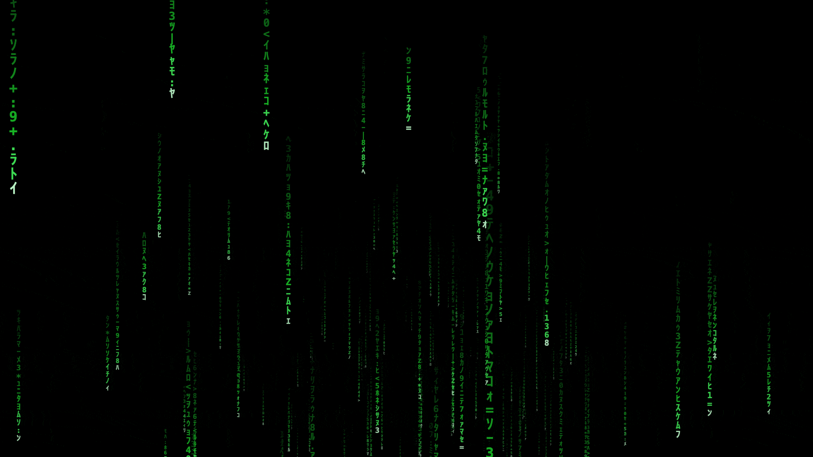

<p align="center">
  
</p>

<h1 align="center">MatrixSaver</h1>

<p align="center"><em>The Matrix digital rain, as a real macOS screensaver — a modern, notarized ExtensionKit app extension that runs on macOS 14 through 27.</em></p>

<p align="center">
  
  <a href="https://github.com/CelestialTech/MatrixSaver/releases/latest"></a>
  <a href="https://github.com/CelestialTech/MatrixSaver/releases"></a>
  
</p>

MatrixSaver is a native green digital-rain screensaver for macOS, built as a modern
ExtensionKit **`.appex`** — the same first-class format Apple's own screensavers
(Flurry, Drift, Computer Name…) use. That is what lets it register and run cleanly on
**macOS 26/27**, where the legacy `.saver` plug-in path has become unreliable. Full-screen
it drives **Monroe Williams' Metal "Matrix"** renderer; for the System Settings preview and
the picker thumbnail it uses an original CoreGraphics renderer.

## Contents

- [Install](#install) · [Requirements](#requirements)
- [How it works](#how-it-works) · [Building it as a modern .appex](#building-it-as-a-modern-appex)
- [Build from source](#build-from-source) · [Headless activation](#headless-activation-wallpaper-store)
- [Grid-tile thumbnail workaround](#grid-tile-thumbnail-workaround-macos-2627) · [Uninstall](#uninstall)
- [Credits & references](#credits--references) · [License](#license)

## Install

Download the notarized installer from the
[**latest release**](https://github.com/CelestialTech/MatrixSaver/releases/latest):

1. Open **`MatrixSaver-1.2.dmg`**.
2. Run the enclosed **`MatrixSaver.pkg`** — it installs `MatrixSaver.app` into
   `/Applications` and the screensaver registers automatically.
   *(You can also download and run `MatrixSaver.pkg` directly, without the DMG.)*
3. Open **System Settings → Screen Saver**, and pick **Matrix**.

Both the `.dmg` and the enclosed `.pkg` are signed with a Developer ID and **notarized and
stapled** by Apple, so they install with no Gatekeeper block — no "cannot be opened because
the developer cannot be verified", no right-click *Open anyway*.

## Requirements

- **macOS 14–27** (Sonoma through the macOS 27 line).
- **Apple Silicon (arm64).** The release binary and `build.sh` compile `-arch arm64` only;
  Intel Macs need a universal rebuild.
- To build from source: Xcode Command Line Tools (`clang`), and Monroe Williams'
  `Matrix.saver` (see [Build from source](#build-from-source) — it is not bundled in this repo).

## How it works

Three thin classes, reverse-engineered from Apple's ObjC `Computer Name.appex`:

| Class | Base (from `ScreenSaver.framework`) | Role |
|---|---|---|
| `MatrixExtension` | `ScreenSaverExtension` | principal class (intentionally minimal) |
| `MatrixViewController` | `ScreenSaverViewController` | selects the renderer by context (below) and vends the view |
| `MatrixView` | `ScreenSaverView` | the CoreGraphics rain: `initWithFrame:isPreview:`, `animateOneFrame`, `drawRect:` |

`ScreenSaverExtension` and `ScreenSaverViewController` have no public headers but are
exported by `ScreenSaver.framework` (its `.tbd` lists them) — declare them locally
(`@interface X : NSObject` / `: NSViewController`) and link `-framework ScreenSaver`.
`ScreenSaverView` is public (`<ScreenSaver/ScreenSaver.h>`).

### Renderer strategy: CoreGraphics offscreen, Monroe's Metal on-screen

The full-screen renderer is **Monroe Williams' Metal "Matrix"**, loaded at runtime from the
bundled `Contents/Resources/Matrix.saver`. Monroe's `MTKView`, however, cannot draw into the
offscreen bitmap context the system uses for thumbnail snapshots — it crashes or renders
blank. `MatrixViewController` therefore selects the renderer by *context*, not by size:

- **`viewDidLayout`** always builds the CoreGraphics `MatrixView` (green; it renders in any
  context, including the offscreen thumbnail snapshot that Monroe cannot).
- **`viewDidAppear`** fires only for an on-screen host — never for the offscreen snapshot —
  and swaps in Monroe's Metal view.

**A non-obvious macOS 26/27 finding:** the System Settings *popover preview* and the *real
full-screen idle run* are the **same wallpaper-agent render path** — both on-screen, both at
the same observed window level (`-2147483625`), indistinguishable from inside the extension by
size, level, or occlusion. You therefore *cannot* run CoreGraphics in the preview and Monroe
full-screen by inspecting the window; both are on-screen, so both get Monroe. The result is
Monroe's green rain full-screen plus a live rain preview (the preview reads blue-tinted only
because of the popover's translucent material). Only the offscreen thumbnail stays on
CoreGraphics.

## Building it as a modern .appex

The `Info.plist` keys that make the bundle a screensaver extension:

```
CFBundlePackageType = XPC!
NSExtension = {
    NSExtensionPointIdentifier = com.apple.screensaver
    NSExtensionPointVersion    = 1.0
    NSExtensionPrincipalClass  = MatrixExtension    # ObjC: no module prefix
}
ScreenSaverViewControllerClass = MatrixViewController
SSEHasConfigureSheet   = false
SSENeedsAnimationTimer = true
```

### The extension must be sandboxed

A screensaver app extension **must be sandboxed**, or `pkd` silently refuses to bind it —
`pluginkit -a` returns 0, but `pluginkit -m -i <id>` shows nothing, and the log reads
`could not create extension point record … -10814`. The required entitlements
(`appex.entitlements`):

```
com.apple.security.app-sandbox                              = true
com.apple.security.cs.disable-library-validation            = true   # loads Monroe's bundle
com.apple.security.temporary-exception.mach-lookup.global-name =
    [ com.apple.CARenderServer, com.apple.CoreDisplay.master, com.apple.ViewBridgeAuxiliary ]
```

For distribution, sign with a **Developer ID** and the hardened runtime (`-o runtime`), applying
those entitlements to the extension, and sign the appex **before** the host app.

### Install location matters

The `.appex` ships inside a host app: `MatrixSaver.app/Contents/PlugIns/MatrixSaver.appex`.
Install it to **one** location and make sure the wallpaper store's bookmark resolves to it.
A mismatch fails silently: if the copy registered with `pluginkit` is not the copy the store's
`Idle` config points to, the reference is dead — the `screenSaver-` cache directory gets an
empty suffix and the picker shows a placeholder tile. The release `.pkg` installs to
`/Applications`; keep a single copy there and don't leave stragglers in `~/Applications` or
DerivedData. Register and verify:

```bash
lsregister -f /Applications/MatrixSaver.app
pluginkit -a /Applications/MatrixSaver.app/Contents/PlugIns/MatrixSaver.appex
pluginkit -m -i io.celestialtech.MatrixSaver.saver   # lists it, SDK = com.apple.screensaver
```

## Build from source

> **Monroe Williams' `Matrix.saver` is not included in this repository.** Obtain it (see
> [Credits](#credits--references)) and place it at
> `MatrixSaver.app/Contents/PlugIns/MatrixSaver.appex/Contents/Resources/Matrix.saver`.
> Without it the full-screen renderer will not load and you get the CoreGraphics rain only.

```bash
./build.sh    # compiles the arm64 binaries (min macOS 14), assembles the bundles,
              # ad-hoc signs, installs to ~/Applications, and registers via pluginkit
```

`build.sh` produces an **ad-hoc, local** build. Two things it does *not* do, which a working
and distributable build needs:

1. **Stage `Matrix.saver`** into the appex's `Contents/Resources` (above).
2. **Force Monroe's Metal renderer** — his saver defaults to an OpenGL path that renders black
   on macOS 26/27. Select Metal via its per-host preference:
   ```bash
   defaults -currentHost write org.indirect.screensaver.Matrix renderer -int 0   # 0 = Metal, 1 = OpenGL
   ```
3. For distribution, **sign + notarize** (ad-hoc signing will not pass Gatekeeper, and an
   unsandboxed appex will not bind):
   ```bash
   codesign -f -o runtime --entitlements appex.entitlements \
     -s "Developer ID Application: …" MatrixSaver.app/Contents/PlugIns/MatrixSaver.appex
   codesign -f -o runtime -s "Developer ID Application: …" MatrixSaver.app
   # build a .pkg (Developer ID Installer), then:
   xcrun notarytool submit MatrixSaver-1.2.dmg --keychain-profile <profile> --wait
   xcrun stapler staple MatrixSaver-1.2.dmg
   ```

## Headless activation (wallpaper store)

Selecting it in System Settings is the normal path. To set it without the UI, write the
`com.apple.wallpaper` store at
`~/Library/Application Support/com.apple.wallpaper/Store/Index.plist`. Set every `Idle` scope
(`AllSpacesAndDisplays.Idle` and each `Displays[*].Idle`) to:

```python
cfg = plistlib.dumps({"module": {"relative":
      "file:///Applications/MatrixSaver.app/Contents/PlugIns/MatrixSaver.appex"}},
      fmt=plistlib.FMT_BINARY)
idle = {"Content": {"Choices": [{"Configuration": cfg, "Files": [],
        "Provider": "com.apple.wallpaper.choice.screen-saver"}]},
        "LastSet": now, "LastUse": now}
```

then `killall WallpaperAgent`. The shape matches the PaperSaver library —
`{module: {relative: <file:// URL>}}` with provider `com.apple.wallpaper.choice.screen-saver`;
the same shape works for a legacy `.saver` by pointing `relative` at the `.saver`. Verify with
`open -a ScreenSaverEngine` (it renders the rain full-screen).

## Grid-tile thumbnail workaround (macOS 26/27)

The large popover preview renders live and works (see
[Renderer strategy](#renderer-strategy-coregraphics-offscreen-monroes-metal-on-screen)). The
small **grid tile** does not: on macOS 26/27 the picker never renders a third-party saver for
its tile — it routes the request through the legacy thumbnail generator, which cannot render a
modern `.appex` and emits a generic **blue-swirl placeholder**. No cache-clear, version bump,
or re-registration dislodges it, and `ScreenSaver.framework` exposes no thumbnail/poster hook.

The workaround replaces the picker's cached tile PNGs with a static Matrix poster (Monroe ships
one: `Matrix.saver/Contents/Resources/thumbnail.png`, green rain) and locks them so they can't
be regenerated:

```bash
T="$(getconf DARWIN_USER_CACHE_DIR)com.apple.wallpaper.extension.legacy/com.apple.wallpaper.legacy.thumbnails"
# Delete Matrix's blue-swirl PNGs and reopen the picker; the two that regenerate are Matrix's
# (one 107x65, one 90x58 — the hashes are per-machine). Then overwrite and lock them:
chflags nouchg "$T"/<matrix-hash>.png
cat green_107x65.png > "$T"/<107x65-hash>.png      # green thumbnail.png, resized
cat green_90x58.png  > "$T"/<90x58-hash>.png       # green thumbnail.png at 90x58
chflags uchg "$T"/<matrix-hash>.png                # lock so the picker can't overwrite
```

This is reversible (`chflags nouchg` + delete regenerates the swirl). Because it overwrites a
system cache and sets the immutable flag, run it only when you intend to.

## Uninstall

```bash
# 1. System Settings → Screen Saver → choose another saver (releases the store reference).
# 2. Deregister and remove the app:
pluginkit -r /Applications/MatrixSaver.app/Contents/PlugIns/MatrixSaver.appex
rm -rf /Applications/MatrixSaver.app        # and ~/Applications/MatrixSaver.app if you built from source
killall WallpaperAgent
# 3. If you applied the thumbnail workaround, unlock the cached PNGs first:
#    chflags nouchg "$(getconf DARWIN_USER_CACHE_DIR)com.apple.wallpaper.extension.legacy/com.apple.wallpaper.legacy.thumbnails"/*.png
```

## Credits & references

- **Full-screen renderer — © Monroe Williams.** The full-screen digital rain is Monroe
  Williams' Metal "Matrix" screensaver (`org.indirect.screensaver.Matrix`), bundled in the
  release at `Contents/Resources/Matrix.saver` (its `thumbnail.png` also backs the grid tile).
  **This is a third-party work, redistributed under its own terms — it is not covered by this
  project's license, and all credit for that renderer is his.**
- **CoreGraphics `MatrixView` renderer, ExtensionKit packaging, and build/install tooling** —
  original to this project.
- **References** — Apple's `Computer Name.appex` (the ObjC blueprint), and the Aerial team's
  `AppexSaverMinimal` and `PaperSaver` (the entitlements set and the wallpaper-store config
  shape).

## License

This project ships no `LICENSE` file; the original code is provided as-is, all rights reserved.
Monroe Williams' bundled `Matrix.saver` is a third-party work under its own terms — see
[Credits](#credits--references).
